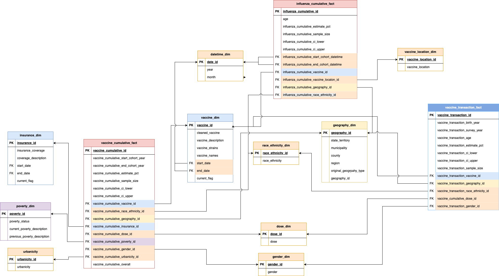
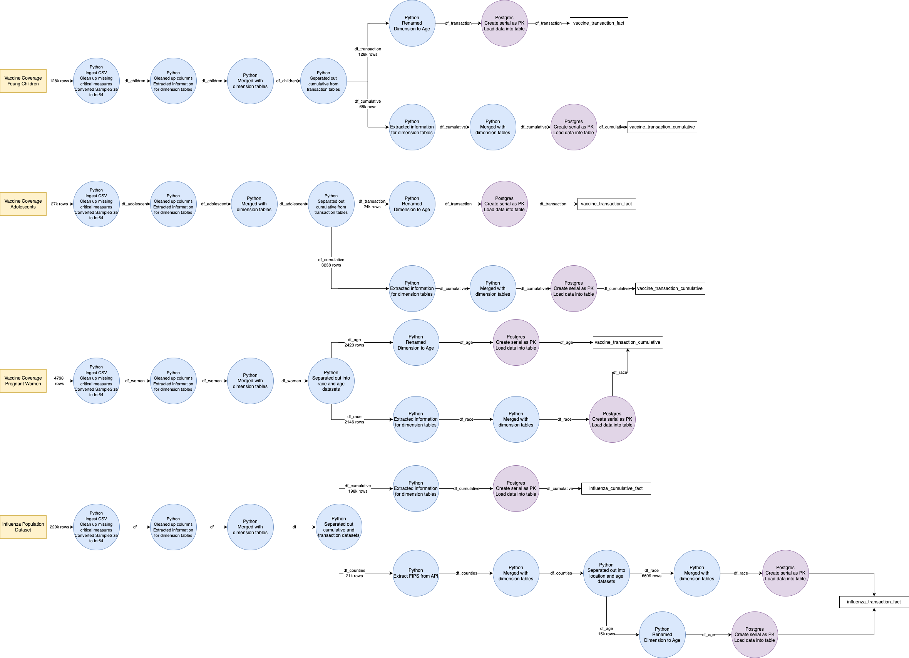

# CS689 Term Project
## Delta Report

## Analysing vaccine trends in US
The ERD for the project has been updated to include the `influenza_transaction_fact` table and the `fips_dimension` table. 

The data flow diagram has been updated to include transformations made in other tables

## Datasets Used:
All datasets are taken from the CDC

[Adolescent Dataset](
https://data.cdc.gov/Teen-Vaccinations/Vaccination-Coverage-among-Adolescents-13-17-Years/ee48-w5t6/about_data)

[Young Children Dataset](
https://data.cdc.gov/Flu-Vaccinations/Influenza-Vaccination-Coverage-for-All-Ages-6-Mont/vh55-3he6/about_data)

[Pregnant Women Dataset](
https://data.cdc.gov/Pregnancy-Vaccination/Vaccination-Coverage-among-Pregnant-Women/h7pm-wmjc/about_data)

[Influenza Dataset](
https://data.cdc.gov/Child-Vaccinations/Vaccination-Coverage-among-Young-Children-0-35-Mon/fhky-rtsk/about_data)

## API Used
The FIPS dataset is obtained through the FIPS API maintained by the [Census Bureau](https://www.census.gov/data/developers/guidance/api-user-guide.html)
